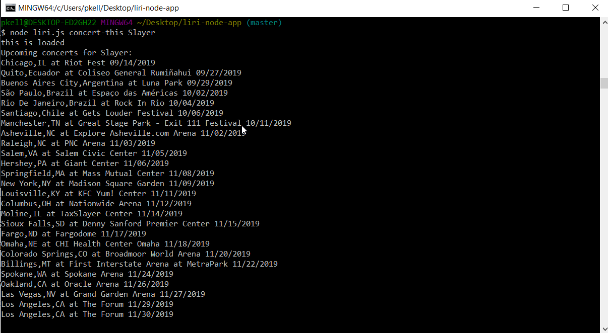
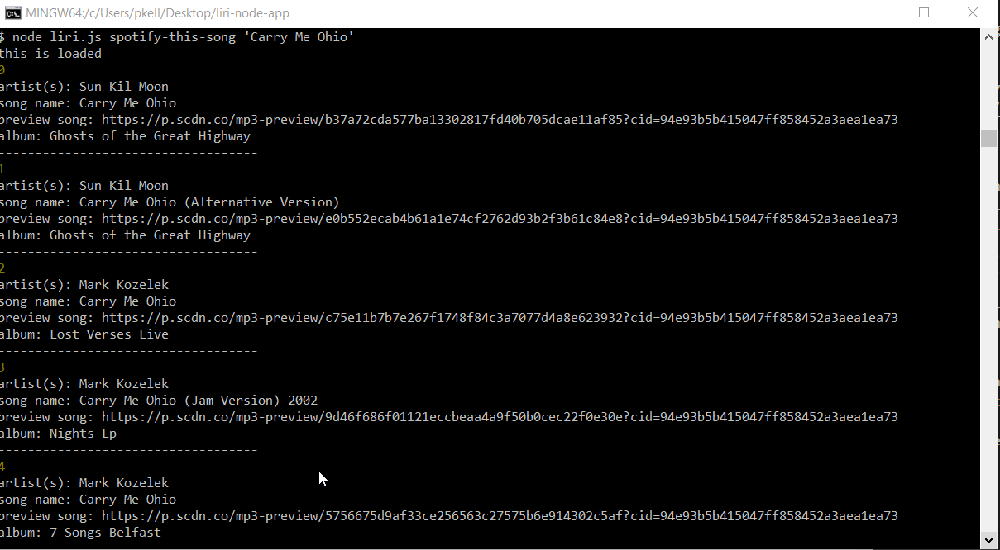
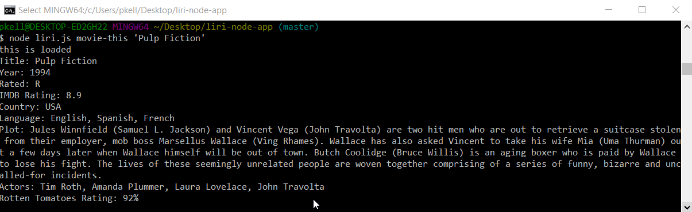
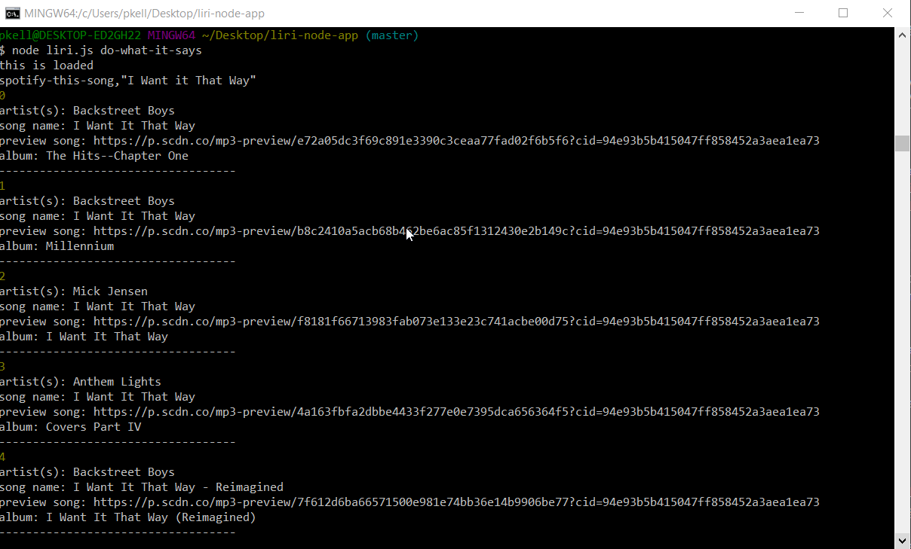

# liri-node-app

## Overview

LIRI (Language Interpretation and Recognition Interface) Bot is a command line node app that will search Spotify for songs, Bands in Town for concerts, and OMDB for movies.

## CLI Commands with examples

1. `node liri.js concert-this <artist/band name here>`

   * This will search the Bands in Town Artist Events API (`"https://rest.bandsintown.com/artists/" + artist + "/events?app_id=codingbootcamp"`) for an artist and render the following information about each event to the terminal:

     * Name of the venue

     * Venue location

     * Date of the Event (use moment to format this as "MM/DD/YYYY")





2. `node liri.js spotify-this-song '<song name here>'`

   * This will show the following information about the song in your terminal/bash window

     * Artist(s)

     * The song's name

     * A preview link of the song from Spotify

     * The album that the song is from




3. `node liri.js movie-this '<movie name here>'`

   * This will output the following information to your terminal/bash window:

     ```
       * Title of the movie.
       * Year the movie came out.
       * IMDB Rating of the movie.
       * Rotten Tomatoes Rating of the movie.
       * Country where the movie was produced.
       * Language of the movie.
       * Plot of the movie.
       * Actors in the movie.
     ```



4. `node liri.js do-what-it-says`

* It will run `spotify-this-song` for "I Want it That Way," as found in `random.txt`.




## Technological Inventory

* [Node-Spotify-API](https://www.npmjs.com/package/node-spotify-api)
* [Axios](https://www.npmjs.com/package/axios)
* [OMDB API](http://www.omdbapi.com)
* [Bands in Town API](https://www.artists.bandsintown.com/bandsintown-api)
* [Moment](https://www.npmjs.com/package/moment)
* [DotEnv](https://www.npmjs.com/package/dotenv)
* [fs](https://www.npmjs.com/package/file-system)
